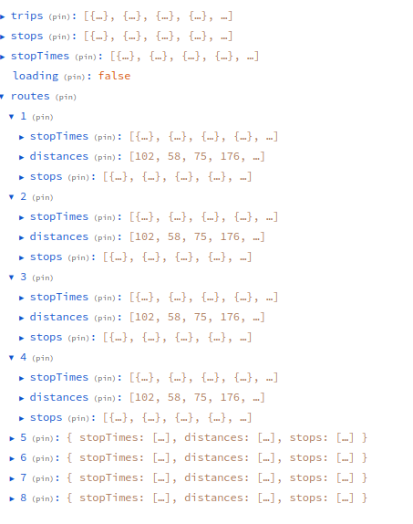
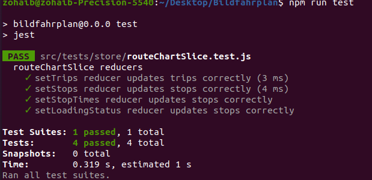

# BildFahrn App

This project is a small React application for visualizing a graphical time schedule for trains using schedule data for Stuttgart. It shows users to filter data for a specific time slot and visualize the distance between stops.

## Steps to Solve the Task

### 1. Data Collection
Obtain the schedule data for Stuttgart, including information about routes, stops, and departure times. 

### 2. Data Filtering
Filter the data to obtain relevent information



### 3. Choose a Visualization Tool
Use Chartjs for visualizing the schedule data.

### 4. Data Parsing
Parse the schedule data using papaparse library to extract relevant information such as route IDs, stop names, arrival times etc

### 7. Distance Calculation
assuming equidistant stations for visualizing the distance between stops


## Features

- Display train schedule data graphically.
- Filter data for a specific time slot (2-6 hours).
- Visualize the distance between stops.
- Assume equidistant stations for calculating distances between stops:
 

## Installation

1. Clone the repository:
```bash
git clone https://github.com/zohaibshahzadkhan/Bildfahrplan
```
   
2. Navigate to the project directory:
   
   ```bash
   cd Bildfahrplan
   ```
3. Install dependencies:
    ```bash
   npm install
   ```
4. Start the development server
   ```bash
   npm run dev 
   ```
   Open your web browser and navigate to http://localhost:5173 to view the app.
   
5.  Run tests
   ```bash
   npm run test 
   ```
   

## Project Structure

- **src/components:** Contains React components used in the application.
- **src/utils:** Contains constant, utility/helpers functions for fetching data and other common tasks.
- **public:** Contains static assets and the index.html file.
- **README.md:** Provides information about the project.

## Technologies Used

- React
- Redux
- JavaScript
- Tailwindcss
- Jest
- Chartjs

  
